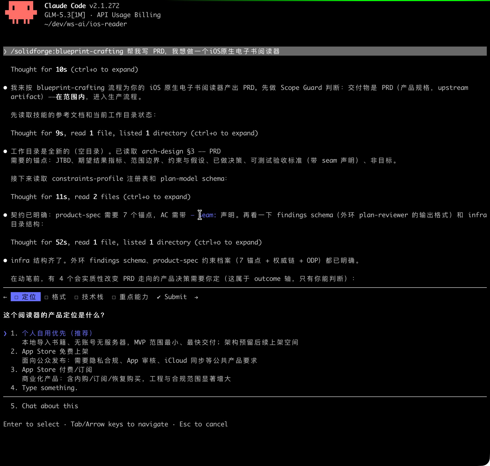
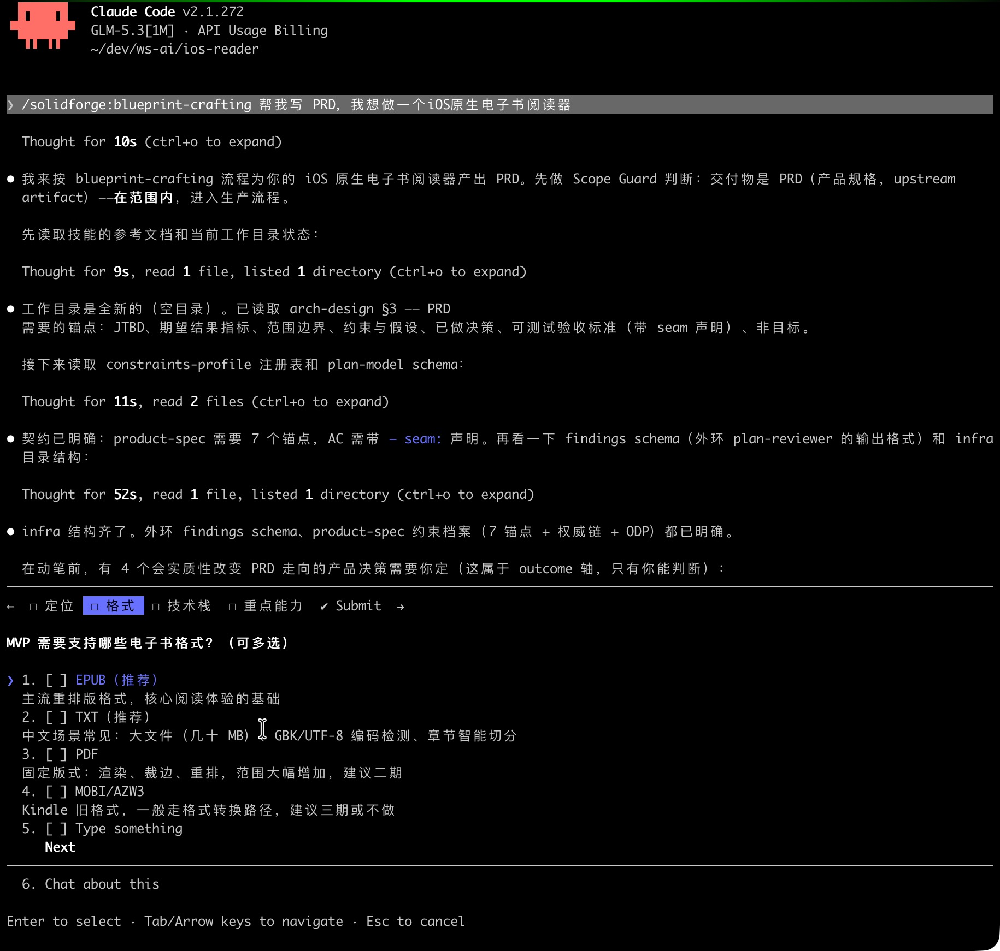
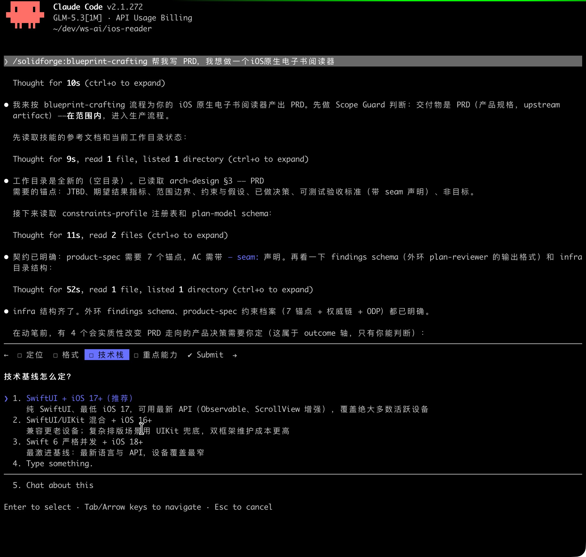
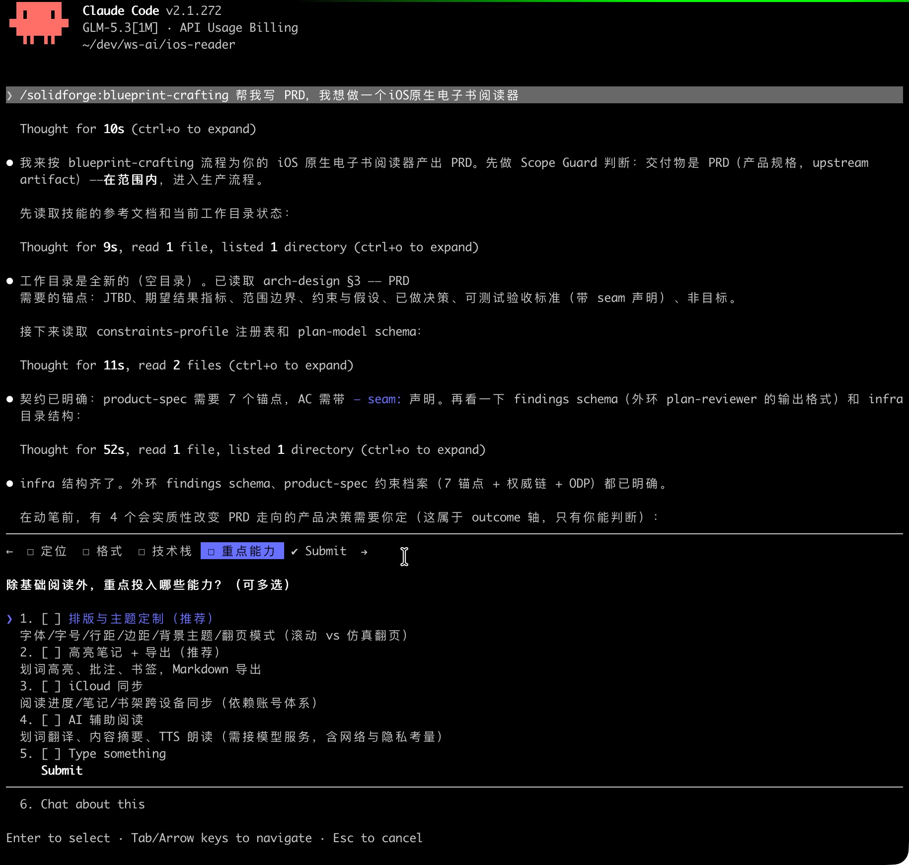
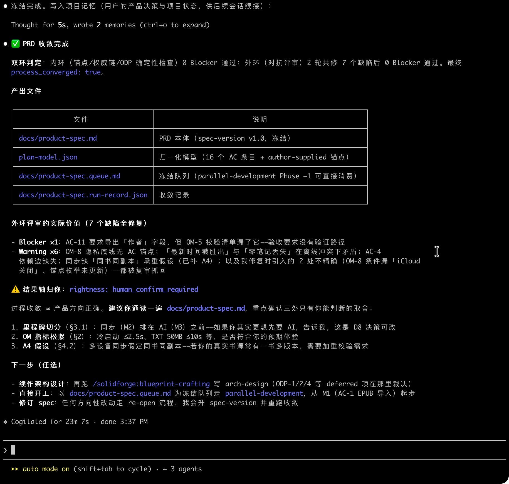

# 从需求开始用 SolidForge

本指南面向这种情况：手里有个想法，或者还不太成型的需求描述，想用 SolidForge 把它一路带到能合并的代码。[USER_GUIDE](../USER_GUIDE.zh-CN.md) 讲的则是另一个场景——任务已经明确，直接 `/parallel-development` 三十秒开工。安装和整体介绍请看 [README](../README.zh-CN.md)。

## 整体是怎么运转的

SolidForge 目前包含 5 个 skill：

```text
csr（把一篇文档磨到收敛）→ bc（把需求做成冻结的 spec）→ pd（照着 spec 写代码，双环收敛）
psv（核对已引用的来源）、prior-art-search（查没引用过的先行技术）——两个按需叠加的求证工具
```

插件清单里还会看到 23 个 `solidforge:` 前缀的子代理和一个 `/solidforge:arm-tools` 命令。
命令需要人输入，子代理则由上面这些 skill 在内部调度。

动手前记住两件事：

第一，你的输入只有两种形态：跟它说话，或者把现成的文本交给它。中间环节，比如建模、跑检查、派子代理——都是由 skill 自己搞定。**不存在"先把需求整理成某种格式再交给它"的前置**。

第二，SolidForge 对“完成”有严格的定义：确定性内环和 AI 外环都通过才算「完成」，而不是"agent 停下来了"。但 SolidForge 无法判断「这个产品方向对不对」——所有结论里，类似这种问题，永远都会标记 `human_confirm_required`。

## 准备工作

安装插件：

```text
/plugin marketplace add maskshell/solidforge
/plugin install solidforge@solidforge
```

到实现阶段，目标项目需要武装一次（生成各语言的架构配置、把循环的运行态加进 `.gitignore` 等）：

```text
/solidforge:arm-tools               # 顺带会报告各门的执行状态
/solidforge:arm-tools --with-tools  # 连门工具一起加进项目 dev deps
```

这件事无需提前做，到 pd 那步之前搞好就可以。武装具体做了什么、门（Gate）工具从哪里解析（为什么默认不执行仓库自带的 node_modules/.bin），可参见 [install.md](../skills/parallel-development/references/install.md)。

另外 csr 的异源腿（不同模型族）需要调用外部模型才能生效，需要单独配置 provider，见 [csr 的安装说明](../skills/cross-source-review/references/install.md)。不用 csr 就不用管，但我建议用。

## 对号入座

- 只有一个模糊的想法，说不清边界：看下面「需求还比较模糊」一节。
- 已经有一篇散文式或半格式化的需求文档：看「需求文档已经写好了」一节。
- 任务已经很具体（"实现 X"、"修 Y"、"重构 Z"）：不需要这篇文档，直接 `/parallel-development`。

## 需求还比较模糊

一句话就能启动：

```text
/blueprint-crafting 帮我写 PRD，我想做……
```

后面的事则由 Skill 主导。bc 拿 PRD 应有的七个部分当可能的访谈提纲向你提问：用户拿这个产品来完成什么工作（JTBD）；怎么算成功、用什么度量（它要的是结果指标，不是功能清单）；明确做什么、明确不做什么；有哪些约束和假设；哪些决策已经拍了板不用再议；每条验收标准怎样算达标；哪些方向显式排除等等等等。你与它交互即可，它负责整理成结构化的 spec。

过程中注意两类事情：

- 碰到事实性的未知（"竞品是怎么做的"、"这个库支不支持 X"），它会派 researcher 去查，产出带引用的 research artifact，不会靠猜。
- 一时确定不了的事情，它不会替你含糊过去，而是记录为 ODP：
  - 冻结前必须拍板的（resolve-now），不拍板收敛就停在那，逼你决策；
  - 可以延后的（deferred），显式带到下游，而不是悄悄消失。

草稿成形后进入收敛环：

- 内环做确定性的完整性、一致性检查；
- 外环是一个独立的 plan-reviewer 对抗审查，找漏洞、过度设计和自相矛盾。

两边都干净，则 spec 文本就可以冻结。

所以你就三件事情要做：回答问题、拍板、最后通读一遍 spec 确认它说的是你想做的东西。最后这步没法外包，机器收敛的是过程，不是产品判断。（当然，你实在要它研究然后帮你拍板也是可以的……）

还有一点就是：不用等需求想清楚再启动。模糊恰恰是本文这一路径的正常起点，收敛环的作用就是把模糊的地方逼出来变成具体的问题，而不是让它们沉在文档里。

## 需求文档已经写好了

输入随便是什么 markdown：散文、笔记、半格式化的描述都可以。即使是 Cursor 的 `.plan.md` 或者工作包 JSON 它也可以识别，但不是必须。

一般情况，我们可以将这些输入直接交给 bc：

```text
/blueprint-crafting 这是我的需求描述：<粘贴，或给个文件路径>
```

这里要说清楚 bc 的定位：**它不是拿你的散文去"校验"一遍打分，而是重写**。散文里的目标陈述将被提炼成 JTBD 和结果指标，隐含的排除项将显式写成非目标，验收期望将改写成可测的验收标准，缺什么补什么，直到收敛环通过。输入不完整是常态，这个 skill 就是为这个目标创造的。

如果这篇文档本身价值高、争议多（多方拼起来的需求、关键决策都压在上面），则可以用 csr (Cross Source Review)，先让它过一轮对抗评审：

```text
/cross-source-review <文档路径>
```

csr 用两条腿进行评审：同源（同家族模型、全新上下文）加异源（不同家族的模型），多轮把文档打磨到实质性收敛——核心论断核实过、连续几轮没有新的 Blocker，注意不是零发现。跑的时候它每两分钟左右自己报一行进度，想盯细一点，可以在新 shell 运行 `csr_progress.py status <run-dir> --watch 5`（进度观测的用法 [csr 安装说明](../skills/cross-source-review/references/install.md)里也写了）。通过 csr 将文档收敛完之后，再丢给 bc。

还有一种情况：文档的核心论点压在外部来源上或者说依托于外部来源，比如外部的论文、标准、技术博客等。这时可以先跑 `/primary-source-verification`，对承重的引用做一次 GO/NO-GO 核查，再投给 csr，csr 之后再跑完整版。顺序的细节参见 [USER_GUIDE](../USER_GUIDE.zh-CN.md)。

## 真实案例

「需求还比较模糊」这节描述的过程，这里收录了一个完整案例（产物放在 [case-ios-reader/](case-ios-reader/) 目录）。起点就是一句话：

```text
/solidforge:blueprint-crafting 帮我写 PRD，我想做一个iOS原生电子书阅读器
```

bc 没有直接开写，先弹了一份分步问卷——定位、格式、技术栈、重点能力，然后每步都带有推荐项：







最后一步把四个待确认的产品决策汇总成一次提交：



问卷答完，spec 初稿即成形，接着再进收敛环。这个例子里，外环（plan-reviewer）跑了不止一轮，先后揪出了 7 个缺陷（findings 编号排到 novel-7），全部修复——末轮剩的两条 warning 是前面修复自己引出的小瑕疵，也改掉了。全程 23 分钟，收尾画面：



产出的文档位于 [product-spec.md](case-ios-reader/product-spec.md) ，质量应该和前文说的那些要求能对应上：16 条验收标准每条带 seam 声明，8 条结果指标全部可测量，8 个已定决策带理由，4 个开放决策点全部显式标为 deferred。冻结的握手件也齐：任务队列 [product-spec.queue.md](case-ios-reader/product-spec.queue.md)（16 项）、收敛凭证 [product-spec.run-record.json](case-ios-reader/product-spec.run-record.json)，外加喂给外环的 [findings.json](case-ios-reader/findings.json) 和 [plan-model.json](case-ios-reader/plan-model.json)。

这个案例只用了 bc —— spec 并没有引用外部来源，psv 的适用条件不满足；文档是单作者一次成稿，也没动用 csr。两个求证工具什么时候该上，上一节有描述。

顺带印证一下「你就三件事情要做」：整个案例里人做的事就是回答问卷（选定位、选格式、选技术栈、勾重点能力）、确认四个决策、通读定稿。23 分钟里剩下的部分全是机器在跑。

## bc 给你什么，什么场景需要什么

不是所有事情都需要完整的 PRD。bc 能够产出五种制品，按规模选：

- **product-spec（即 PRD）**：产品级决策，就是上面那七个部分。
- **arch-design**：系统设计——分层、关键技术决策及理由、并行边界、失败模式。
- **iteration-plan**：多轮迭代的执行蓝图——复杂度分级、依赖关系、每轮的验收闸。
- **executable-summary**：中小改动——待办加首个工作包，够用。
- **research**：知识型产出——带引用的主张、来源、成本台账。

每次跑完，除了文档本体，还会多出两个文件：`.queue.md`（冻结的任务队列）和 `.run-record.json`（收敛凭证）。这两个是给Agent读的握手件，你一般不用看，但它们跟着文档一起进 git，可供追溯。

## 进入实现

```text
/solidforge:arm-tools        # 如果还没武装
/parallel-development 按冻结的 spec 实现
```

pd 会照着队列干活：跑双环收敛循环（快速门、架构契约门、测试、AI 评审），在 feature 分支上逐段提交，不直接动主分支，最后会给出一份报告。你不需要指挥任何子代理或钩子。pd 的其它用法 —— 不带 spec 直接接任务、各平台的门都在查什么——参见 [USER_GUIDE](../USER_GUIDE.zh-CN.md)。

## 实现中发现需求有问题怎么办

这是设计进去的路径，不是异常情况。如果 pd 发现 spec 里验收标准声明的边界（seam）跟实际对不上，它会升级回 bc：冻结的 spec 作为一次修订重新进收敛环，改完再传播回正在跑的任务。整个过程是自动的，你会在会话里看到它发生。所以需求文档不是瀑布式的一次性产物，它具有从实现侧回来的反馈通道。

## 产出物能不能给团队里其他人用

能，而且这是有意设计的。

所有产出物都是纯文本：spec 是 markdown，队列和运行记录是 JSON，全部 git 原生 —— 可 diff、可进 PR、可版本化。本仓库自己就是证据：spec、`.queue.md`、`.run-record.json`、csr 收敛记录都跟文档并排提交在 git 里。

更根本的原因在架构上：bc 和 pd 两个 skill 之间不共享任何代码，只通过冻结的产出物耦合。系统内部消费这些文件，所以它们必须是良构的合同。换句话说，这套协议先在机器之间跑通了，人拿来用是顺带的。

各个文件在协作里扮演的角色：

- **spec 本体**：人和 agent 共读的权威源。多份文档冲突时按 authority chain 仲裁（spec > blueprint > summary > companion，首条说了算）。文档顶部有 `spec-version:` 行，运行记录里记着 re-open 条目，接手的队友能判断手上的版本是不是最新、有没有被修订过。
- **验收标准的 seam 尾巴**：spec 和实现之间的边界协议。声明的公共边界名，谁接手实现，对齐的都是同一个替换点。
- **`.queue.md`**：bc 到 pd 的握手合同。executable subset（item_id / seq / depends_on / dod_ref）两边无损往返。换个会话、换台机器接手实现，消费的是同一份队列。
- **`.run-record.json`**：收敛凭证。裁决就两个字段：`process_converged` 是不是真，rightness 恒为 `human_confirm_required`。接手的人读它来判断要不要重新收敛，不用盲目重跑。跨会话接手本来就是常态用法。
- **csr 收敛记录**：审计用的。每一轮的发现和逐条处置都嵌在记录里，后来的评审者可以对每一个 finding 重新下判断。
- **psv 和 prior-art-search 的披露**：`oracle_verified_under_known_coverage`、`collisions_under_known_coverage`，名字起得很诚实，直接告诉你核实到了什么程度。下游的人既不会盲目复用，也不用从零重做。

这套东西在团队里靠得住，靠的是三件事。

1. 内环的门是确定性脚本，使用 Python 标准库编写，作用于项目目录：同样的输入，谁跑、哪个会话跑、哪个家族的模型跑，结果一样，「过没过」不取决于谁在场。
2. 产出物按「换不同家族的模型也能解析」的标准来书写，定界符、schema、指令都写在明面上，即有明确协议。
3. 最后，产品判断的位置永远留给人：机器陈述过程状态，PR review、会签、放行，都是人的事。

边界也说清楚：

- 循环的执行现场（运行态、csr 的 run 目录）不进 git，arm 会把它们加进 `.gitignore`。该共享的是冻结的产出物和收敛记录，不是执行过程本身。
- `.queue.md` 和 `.run-record.json` 是给 agent 读的，人读 spec 本体和收敛记录就好。这个分工是设计出来的。
- 这套协议管的是过程，**不管对错**。产出物能告诉队友"过程收敛了、引用核实到了哪个程度、先行技术查过哪些方向"，产品层面的评审替代不了。
- 异源腿的结论要在另一台机器上复现，得各自配 provider；同源腿和确定性门没有这个依赖。

## 怎么理解"收敛了"

`process_converged` 为真，意思是该有的都有、对抗审查没有 Blocker、该拍的决策都拍了。这是机器承诺的范围。psv 和 prior-art-search 的产出同理，是"已知覆盖下的核实/碰撞披露"，不是"正确/新颖"的保证。所以流程的最后一步永远是人的：通读冻结的 spec，确认它说的是你想做的东西，再放行给 pd。

## 命令速查

```text
/blueprint-crafting 帮我写 PRD，我想做……          # 从模糊想法开始，访谈式梳理
/blueprint-crafting 这是我的需求描述……            # 从现成文本开始，重写到收敛
/cross-source-review <文档>                       # 文档本身的对抗收敛
/primary-source-verification <文档>               # 逐条核对已引用的来源
/prior-art-search <文档>                           # 查未引用的先行技术
/parallel-development 按 spec 实现……              # 照冻结 spec 写代码
/solidforge:arm-tools                             # 武装目标项目
```

激活方式有个差别：csr、psv、prior-art-search 目前只能显式 slash 调用；bc 和 pd 用自然语言描述通常也能路由过去，想百分百确定就用 slash。

## 最后几个坑

- 别去手工构造 plan-model 或者标注 anchors。那是 skill 内部的机械步骤，你的输入就是对话或者现成文本，有些介绍会把这步说成用户作业，别信。
- 别等需求完美再启动。模糊是正常起点，收敛环就是干这个的。
- 别给小改动套完整 PRD。executable-summary 够了，甚至直接 pd。
- 别把过程收敛当成产品正确。最后一步判断是你的，让不出去。

## 延伸阅读

- [README](../README.zh-CN.md)——安装、五个 skill 与全套代理钩子的完整介绍。
- [USER_GUIDE](../USER_GUIDE.zh-CN.md)——完整用户手册：各种工作流、成熟度模型。本文只取了它上游的一段。
- [install.md](../skills/parallel-development/references/install.md)——武装与门工具的细节：各语言配了什么、工具解析的信任边界。
- [maturity.md](../skills/parallel-development/references/maturity.md)——成熟度框架：什么阶段可以信哪一层的保证。
- [csr 安装说明](../skills/cross-source-review/references/install.md)——异源 provider 配置、进度观测。
